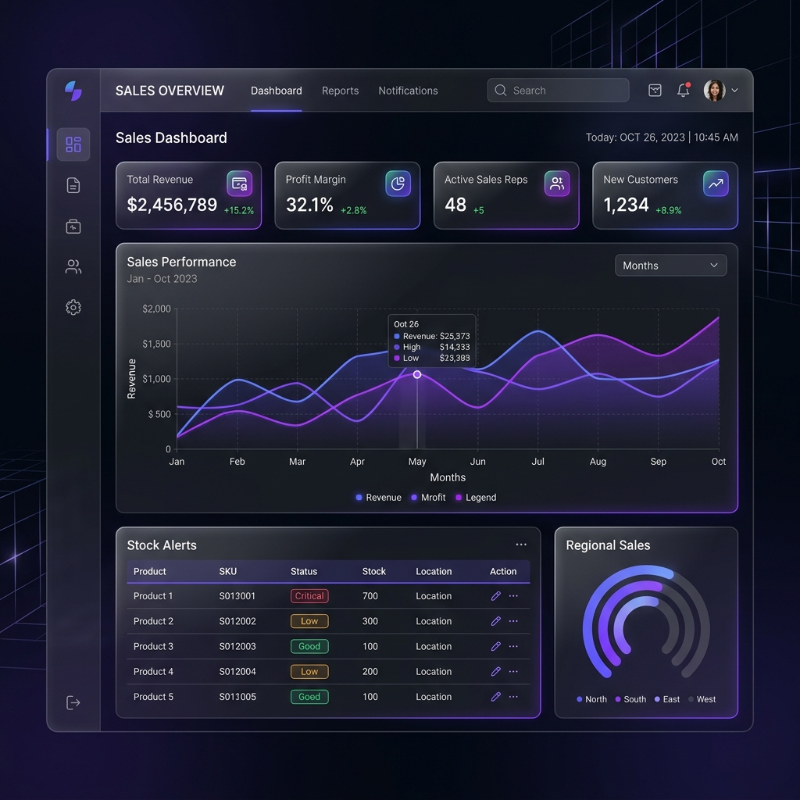

# SalesPulse: Your Sales Data. Now with a Pulse.


SalesPulse is a next-generation, AI-driven sales management and analytics platform built for modern businesses. It combines real-time inventory tracking with deep financial insights and a premium user experience.

---

## ✨ Key Features

- **🧠 AI Business Intelligence**: Natural language querying for inventory and sales performance using Llama 3.3.
- **🏢 Multi-Tenant Architecture**: Manage multiple businesses or branches under a single secure umbrella.
- **📦 Inventory & SKU Management**: Real-time stock levels, low-stock thresholds, and categorized product tracking.
- **🤝 Customer Relationship Management**: Track customer lifetime value, order frequency, and purchase history.
- **📊 Financial Analytics**: Automated profit calculations, revenue tracking, and interactive growth charts.
- **📱 Responsive UI**: High-end glassmorphic design that works seamlessly on desktop and mobile devices.

---

## 🛠 Technology Stack

- **Framework**: [Next.js 16 (App Router)](https://nextjs.org/)
- **Database**: [Neon](https://neon.tech/) (Serverless PostgreSQL)
- **ORM**: [Drizzle ORM](https://orm.drizzle.team/) (Type-safe database operations)
- **Authentication**: [NextAuth.js v5](https://authjs.dev/)
- **Styling**: [Tailwind CSS 4](https://tailwindcss.com/)
- **Animations**: [Framer Motion](https://www.framer.com/motion/)
- **Charts**: [Recharts](https://recharts.org/)
- **Components**: [Radix UI](https://www.radix-ui.com/) & [Shadcn UI](https://ui.shadcn.com/)

---

## 🏗 Implementation Architecture

SalesPulse is designed with a focus on performance, scalability, and developer experience:

- **Server-First Design**: Leverages Next.js Server Components and Server Actions to minimize client-side JavaScript.
- **Type-Safe Everything**: End-to-end type safety from the database schema (Drizzle) to the UI components.
- **Atomic Components**: A robust design system built on Shadcn UI, ensuring consistency and rapid UI iteration.
- **Optimized Data Fetching**: Utilizes server-side data fetching patterns to ensure near-instant page transitions and SEO optimization.
- **Secure by Default**: Implements role-based access control (RBAC) and bcrypt password hashing.

---

## 🚀 Future Roadmap

We are constantly evolving. Here is what's coming next:

- **[ ] AI Revenue Forecasting**: Predictive analytics to estimate future sales based on historical data.
- **[ ] Global Multi-Currency**: Support for international sales with real-time currency conversion.
- **[ ] POS Terminal Integration**: Direct sync with hardware Point of Sale systems.
- **[ ] Native Mobile App**: A dedicated iOS and Android application for on-the-go management.
- **[ ] Automated Messaging**: Automated invoice delivery via Email and WhatsApp.
- **[ ] Advanced Audit Logs**: Detailed tracking of all administrative changes for enterprise-grade security.

---

## 🏁 Getting Started

### Prerequisites
- Node.js 20+
- A Neon Database (PostgreSQL)

### Installation

1. **Clone the repository**
   ```bash
   git clone https://github.com/itzmahtab/SalesPulse.git
   cd SalesPulse
   ```

2. **Install dependencies**
   ```bash
   npm install
   ```

3. **Environment Setup**
   Create a `.env` file in the root directory:
   ```env
   DATABASE_URL=your_neon_db_url
   AUTH_SECRET=your_auth_secret
   ```

4. **Push Schema to DB**
   ```bash
   npx drizzle-kit push
   ```

5. **Run Development Server**
   ```bash
   npm run dev
   ```

---

## 📂 Project Structure

```text
├── app/               # Next.js App Router (Auth, Dashboard, API)
├── components/        # Reusable UI & Layout components
├── lib/               # Shared logic (DB schema, Auth config, Utils)
├── public/            # Static assets
├── types/             # TypeScript type definitions
└── drizzle.config.ts  # Database configuration
```



---

## 📄 License

This project is licensed under the MIT License.
